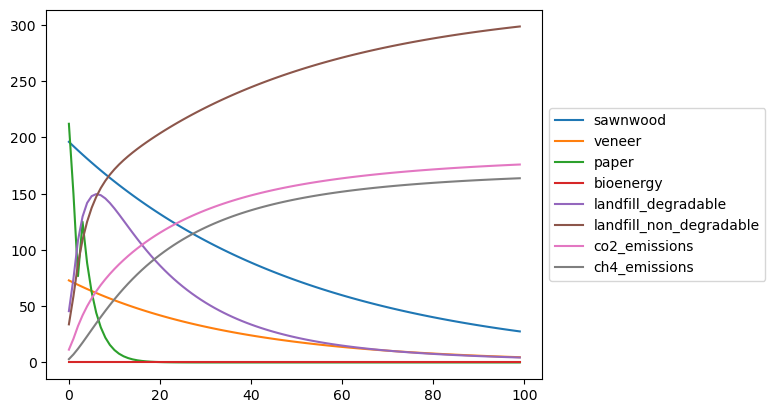

# hwp_carbon

Modeling carbon flows in a harvested wood products network

## What does hwp_carbon do ? 

hwp_carbon creates a direct graph for modelling carbon flows in a harvested wood products network and simulate carbon 
flows and decomposition through multiples carbon pools. Users can specifies any network configuration they want and 
adjust the following parameters :
* Carbon pools and their half-life [fixed value for each pool]
* Split ratio between a parent pool and multiple child pools [variable value if desired]
* Carbon substitution rate [variable value if desired]

For the moment, harvest wood products degradation is only simulated used a radioactive decay, i.e. each carbon pool has 
a half-life which is the time required for a quantity of carbon to reduce to half of its initial value.

Having a cyclic network (also known as cyclic graph) is possible and handled via recursion.

## Installing
The package can be directly installed from github with pip : 
```bash
pip install git+https://github.com/https://github.com/pierre-cantegril/hwp_carbon
```

### [Optional] Rendering the network as a directed graph
`hwp_carbon` uses [Graphviz](https://www.graphviz.org/) to plot the network as a directed graph. 

If you use pip, you will have to install Graphviz executable. See the installation section here : 
[PyPI Graphviz page](https://pypi.org/project/graphviz/).

If you use conde, you can simply install the `python-graphviz` package:
`conda install python-graphviz`

## Workflow
### Creating a carbon network
#### Network configuration data
hwp_carbon creates a network from configuration tables which specifies the nodes, edges and parameters. 
The tables can also be passed as a dictionary (see `init_data` variable in the below code).

See a [Network Configuration Table Example](./tests/test_data.xlsx)

#### Use configuration data

The following command will create a carbon network from an Excel file :

```python
from hwp_carbon.network import CarbonNetwork
from hwp_carbon.utils import excel_to_carbonnetwork_init_data

init_data = excel_to_carbonnetwork_init_data('../tests/test_data.xlsx')
net = CarbonNetwork(init_data)
```
### Plotting the network
`plotting_network` module contains basic code to generate a dot file. If the requirements are met 
([See this section](#Rendering-the network-as-a-directed-graph-[Optional-installation])), the network can be displayed:
```python
from hwp_carbon.network_plotting import network_to_dot
dot = network_to_dot(net)
dot.graph_attr['splines'] = 'spline'
dot
```
By default, the split ratio is displayed between a pool and its children. Recycling flow are displayed in red.


### Simulating carbon flow
To simulate carbon flows, the user must supply the carbon inputs to the network. The inputs must be the following type :
`dict[pool_name, Sequence]`:
```python
inputs = {'paper': [300, 0, 0, 100], 
          'veneer': [75], 
          'sawnwood':[200]}
```
Here the paper pool will receive respectively 300 and 100 units of carbon at the beginning of year 1 and 4, the veneer 
pool will receive 75 unit at the beginning of year 1 and the sawnwood pool will receive 200 unit at the beginning of year 1.

Optionally the number of simulation years can be specified. If not, the simulation will be done on the maximum length
of the inputs values (here 4 years because `len(inputs["paper"]) == 4`).

To run the simulation:
```python
net.run_simulation(inputs, steps=steps)
```

### Results
The results are stored in the CarbonNetwork instance that run the simulation.
The `CarbonNetwork.get_pools_attr` and `CarbonNetwork.get_flows_attr` methods are used to get the results. 
Using `as_dataframe=True` returns a pandas.Dataframe else a dictionary.
Some useful results are :
```python
net.get_pools_attr('carbon_stock', as_dataframe=True) # Carbon stocking for each pool each year
net.get_pools_attr('substitution', as_dataframe=True) # Carbon substituion for each pool each year
net.get_flows_attr('values', as_dataframe=True) # Flows between each pools for each year
```

Results can be directly be plotted using `pandas.DataFrame.plot()` method:
```python
net.get_pools_attr('carbon_stock', as_dataframe=True).T.plot().legend(loc='center left', bbox_to_anchor=(1, 0.5))
```

